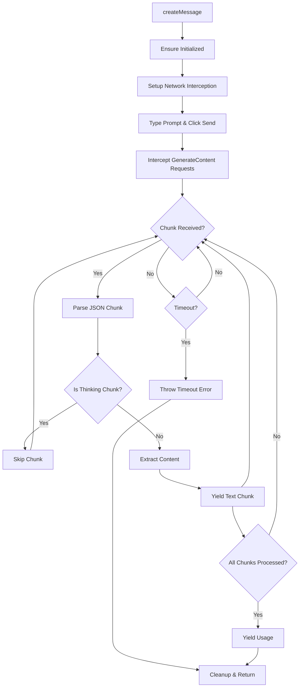

# Web UI Studio Handler Refactoring Plan

**Date:** 2025-09-02
**Objective:** Refactor `WebUiStudioHandler` to use network interception similar to `WebUiGeminiHandler` instead of UI automation and clipboard access.

## Current Implementation Analysis

### WebUiStudioHandler (Current)

- **Method:** UI Automation + Clipboard
- **Flow:** Type prompt → Click send → Wait for processing → Click "More options" → Click "Copy markdown" → Read clipboard
- **Pros:** Works with existing UI
- **Cons:** Brittle, slow, depends on UI stability, clipboard access permissions

### WebUiGeminiHandler (Target)

- **Method:** Network Interception via CDP
- **Flow:** Type prompt → Click send → Intercept `StreamGenerate` requests → Parse response body
- **Pros:** More reliable, faster, doesn't depend on UI elements
- **Cons:** Requires understanding of network protocol

## Network Analysis

### AI Studio Endpoints (from browser trace)

- `GenerateContent` - Main response endpoint (xhr, ~1.1 kB, ~7.48s)
- `GenerateTitle` - Title generation
- `CreatePrompt` - Prompt management
- `ListPrompts` - Prompt listing
- `CountTokens` - Token counting

### GenerateContent Response Structure

```json
[
	[
		[
			[
				[
					[
						[
							[
								null,
								"**Thinking content...**",
								null,
								null,
								null,
								null,
								null,
								null,
								null,
								null,
								null,
								null,
								1
							]
						],
						"model"
					]
				]
			],
			null,
			[5, null, 77, null, [[1, 5]], null, null, null, null, 72],
			null,
			null,
			null,
			null,
			"v1:ChdR..."
		],
		// ... more chunks
		[
			[[[[[null, "Final response content"]], "model"], 1]],
			null,
			[5, 12, 688, null, [[1, 5]], null, null, null, null, 671],
			null,
			null,
			null,
			null,
			"v1:ChdR..."
		]
	]
]
```

**Key Points:**

- Content is at `response[0][0][0][0][0][0][0][1]`
- Multiple chunks arrive over time (streaming)
- "Thinking" chunks start with `**` and contain reasoning
- Final chunks contain the actual response
- Need to filter out thinking chunks and concatenate final response

## Refactoring Plan

### Phase 1: Infrastructure Setup

1. **Add CDP Session Management**

    - Import `CDPSession` from puppeteer-core
    - Add `_cdpSession` property to class
    - Initialize CDP session in `_initializeInternal()`
    - Clean up CDP session in `_cleanupPuppeteerResources()`

2. **Update Constructor & Initialization**
    - Add CDP session initialization
    - Set up network interception patterns
    - Bypass service worker for clean interception

### Phase 2: Network Interception Implementation

1. **Create Response Parser Function**

    ```typescript
    function parseGenerateContentResponse(jsonString: string): string | null {
    	// Parse nested JSON structure
    	// Extract content from [0][0][0][0][0][0][0][1]
    	// Filter out thinking chunks (starting with **)
    	// Return final response content
    }
    ```

2. **Implement Streaming Handler**

    - Set up `Fetch.enable` with pattern for GenerateContent
    - Create promise-based response handler
    - Handle multiple chunks over time
    - Yield text chunks as they arrive (streaming)

3. **Replace UI Automation Logic**
    - Remove clipboard permissions setup
    - Remove "More options" and "Copy markdown" button interactions
    - Replace with network interception in `createMessage()`

### Phase 3: Streaming Integration

1. **Implement Async Generator Pattern**

    ```typescript
    async *createMessage(systemPrompt: string, messages: Anthropic.Messages.MessageParam[]): ApiStream {
        // Intercept network requests
        // Parse streaming chunks
        // Yield text chunks
        // Yield usage information
    }
    ```

2. **Handle Chunk Processing**
    - Process each JSON chunk as it arrives
    - Extract and filter content
    - Maintain response state across chunks
    - Handle malformed tokens (regeneration logic)

### Phase 4: Error Handling & Cleanup

1. **Update Error Handling**

    - Handle CDP session errors
    - Network interception failures
    - JSON parsing errors
    - Timeout scenarios

2. **Preserve Existing Logic**
    - Maintain regeneration logic for malformed tokens
    - Keep existing timeout and retry mechanisms
    - Preserve initialization and cleanup patterns

## Implementation Flow Diagram



## Key Technical Decisions

### 1. Network Interception Strategy

- **Pattern:** `{ urlPattern: "*GenerateContent*", requestStage: "Response" }`
- **Method:** Use `Fetch.enable` and `Fetch.requestPaused` events
- **Parsing:** Custom parser for nested JSON structure

### 2. Streaming Implementation

- **Pattern:** Async generator yielding text chunks
- **Filtering:** Skip chunks starting with `**` (thinking content)
- **Concatenation:** Combine final response chunks
- **Usage:** Yield token counts at completion

### 3. Error Handling Strategy

- **Fallback:** Keep UI automation as backup
- **Timeouts:** Respect existing `puppeteerTimeout` settings
- **Recovery:** Allow re-initialization on failures

## Benefits of Refactoring

1. **Reliability:** Less dependent on UI element stability
2. **Performance:** Faster response times (no clipboard operations)
3. **Maintainability:** Cleaner code, easier to debug
4. **Streaming:** Real-time text streaming like modern APIs
5. **Robustness:** Better error handling and recovery

## Migration Strategy

1. **Direct Replacement:** Replace UI automation with network interception completely
2. **Testing:** Comprehensive testing of the new interception approach
3. **Single Implementation:** No fallback to UI automation - interception only

## Risk Assessment

### High Risk

- JSON parsing failures if response structure changes
- Network interception setup complexity
- Streaming chunk processing timing issues

### Medium Risk

- CDP session management complexity
- Browser compatibility issues
- Performance impact of interception

### Low Risk

- Existing error handling patterns can be reused
- CDP session management follows established patterns from Gemini handler
- JSON parsing can be made robust with proper error handling

## Success Criteria

1. **Functional:** Network interception produces same results as UI automation
2. **Performance:** Faster response times than current implementation
3. **Reliability:** Fewer failures due to UI changes
4. **Streaming:** Real-time text delivery to user interface
5. **Maintainability:** Cleaner, more understandable code

## Next Steps

1. Implement CDP session management
2. Create GenerateContent response parser
3. Implement network interception logic
4. Test streaming functionality
5. Performance comparison testing
6. Documentation updates
